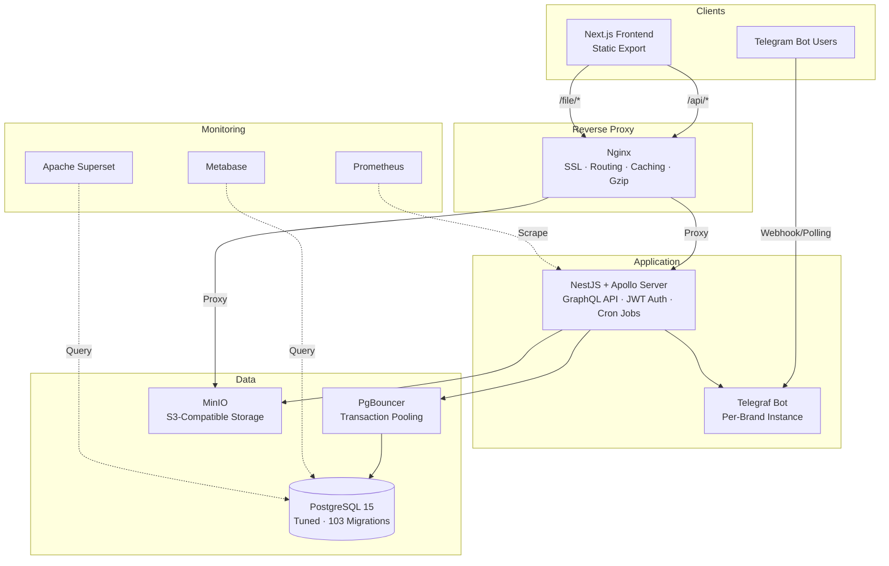

# OptiNetFlow — Backend

Production backend for a consumer subscription platform that processed **100,000+ sales** with **5,000+ concurrent paying subscribers**. Built and operated solo — I was the sole developer, architect, and operator. The business ran for 2+ years and was shut down due to external regulatory conditions, not technical failure.

**Stack:** NestJS · GraphQL (Apollo Server) · Prisma ORM · PostgreSQL · PgBouncer · MinIO · Telegraf · Docker · Prometheus · GitHub Actions CI/CD

## Architecture



## Project Structure

```
src/
├── auth/              # JWT + OTP authentication, signup/login, password reset
├── users/             # User CRUD, parent-child hierarchy, discount management
├── brand/             # Multi-tenant brand system (domain, bot, report groups)
├── package/           # Subscription packages, purchases, renewals, bundles
├── payment/           # Payment processing, receipt verification, wallet recharge
├── telegram/          # Telegraf bot — per-brand instances, registration, notifications
├── server/            # VPN server management, country routing, inbound config
├── xui/               # X-UI panel API integration (client stats, provisioning)
├── promotion/         # Promo codes, referral system, gift packages
├── sms/               # SMS OTP delivery (SMS.ir provider)
├── minio/             # S3-compatible file storage (receipts, avatars)
├── prometheus/        # Prometheus metrics queries
├── ai/                # GCP Vertex AI integration
├── prisma/            # Database client, exception filters
├── common/
│   ├── configs/       # App configuration (JWT, CORS, Swagger, etc.)
│   ├── decorators/    # Custom decorators (current user, roles)
│   ├── guards/        # Auth guards (JWT, admin, optional auth)
│   ├── interceptors/  # Response timing
│   ├── pagination/    # Relay-style cursor pagination
│   ├── pipes/         # Validation pipes
│   └── services/      # Shared services (XUI client, server management)
├── app.module.ts      # Root module — all imports
├── main.ts            # Bootstrap — validation, filters, CORS, Swagger
└── gql-config.service.ts
prisma/
├── schema.prisma      # 15 models, 6 enums, 1 database view
├── migrations/        # 103 migrations (Dec 2023 → Feb 2026)
├── seed.ts
└── dbml/              # Auto-generated DBML from schema
```

## Tech Stack — Why Each Choice

| Technology | Why |
|---|---|
| **NestJS** | Modular architecture with dependency injection. For a solo developer managing 15+ modules, NestJS's opinionated structure prevents the codebase from becoming a monolithic Express app. Guards, interceptors, and pipes enforce cross-cutting concerns consistently. |
| **GraphQL (Apollo Server)** | The frontend needed flexible data fetching across deeply nested relationships (users → packages → payments → stats). GraphQL eliminated the need for dozens of REST endpoints and enabled the frontend to request exactly the data shapes it needed. |
| **Prisma ORM** | Type-safe database access that catches schema mismatches at compile time. The generated client gives IDE autocomplete for all 15 models. Migration system tracked 103 schema changes across 2+ years of production without data loss. |
| **PostgreSQL 15** | Battle-tested relational database. The data model has deep relational constraints (user hierarchies, payment → package → server chains) that benefit from foreign keys and transactions. Tuned with custom parameters for this workload (shared_buffers=2GB, work_mem=64MB, JIT off). |
| **PgBouncer** | Transaction-mode connection pooling. With 5,000+ concurrent subscribers and a single application server, PgBouncer prevents connection exhaustion. Configured with MAX_CLIENT_CONN=200, DEFAULT_POOL_SIZE=50. Prisma connects through PgBouncer with `?pgbouncer=true&pool_timeout=20`. |
| **MinIO** | S3-compatible object storage for payment receipts and user avatars. Self-hosted — avoids cloud vendor lock-in and keeps all data on the same server for latency and cost. |
| **Telegraf** | Telegram bot framework. Each brand gets its own bot instance. Used for user registration (deep links), payment approval/rejection workflows, and bulk notifications. Handles Telegram API errors (blocked bot, rate limits, deactivated users). |
| **Docker (ARM64)** | Multi-stage ARM64 builds for deployment on ARM-based servers. Self-managed Docker Compose for all services — no managed cloud dependencies. Healthchecks with autoheal for automatic container recovery. |
| **GitHub Actions** | CI/CD pipeline: generate Prisma client → SSH tunnel to production DB for migrations → build ARM64 Docker image → push to Docker Hub → deploy via SSH. Previously CircleCI — migrated to GitHub Actions. |

## Key Engineering Decisions

### Multi-Tenant Architecture via Brand Model

Each brand has its own domain, Telegram bot, and report groups. Users are scoped to a brand via `@@unique([phone, brandId])`. This enables running multiple white-label instances from a single backend deployment — one codebase, one database, multiple customer-facing brands.

```prisma
model Brand {
  domainName  String @unique
  botToken    String
  botUsername String @unique
  User        User[]
}

model User {
  brandId String @db.Uuid
  brand   Brand? @relation(fields: [brandId], references: [id])
  @@unique([phone, brandId], name: "UserPhoneBrandIdUnique")
}
```

### User Hierarchy (Reseller Network)

Users have both a `parent` (direct reseller relationship) and a `referParent` (promotional referral). This two-tier hierarchy enables a reseller network where parents set discount percentages for their children, track profit margins, and receive Telegram notifications for purchases.

### OTP Authentication Flow

Phone-based auth with OTP, not email. The signup flow: register with phone + password → receive SMS OTP → verify phone → JWT issued in HTTP-only cookie. Refresh tokens handled server-side. OTP has configurable expiration (`OTP_EXPIRATION` in minutes). This matches the user base — Iranian consumers who use phone numbers as their primary identifier.

### Payment Approval via Telegram

Payments use a receipt-based flow: user uploads payment receipt image → stored in MinIO → Telegram notification sent to brand's report group with Accept/Reject inline buttons → admin approves or rejects → balance updated. This eliminated the need for a payment gateway integration (which was unavailable due to regulatory constraints).

```
User uploads receipt → MinIO storage → Telegram notification (with inline keyboard)
                                              ↓
                              Admin taps Accept/Reject in Telegram
                                              ↓
                              Payment state: PENDING → APPLIED/REJECTED
                                              ↓
                              User balance updated, package provisioned
```

### PgBouncer for Connection Pooling

Prisma's connection handling with 5,000+ concurrent users would exhaust PostgreSQL's connection limit. PgBouncer in transaction mode sits between the app and PostgreSQL, maintaining a pool of 50 connections that serve up to 200 concurrent client connections. The `?pgbouncer=true` flag in the DATABASE_URL tells Prisma to disable prepared statements (incompatible with transaction pooling).

### Relay-Style Cursor Pagination

Uses `@devoxa/prisma-relay-cursor-connection` for cursor-based pagination in GraphQL. Cursor pagination is more reliable than offset-based pagination when underlying data changes between page requests — important for a platform where new purchases and payments are created continuously.

### Database Tuning

PostgreSQL is tuned for this specific workload rather than running with defaults:

- `shared_buffers=2GB` — dedicated buffer cache
- `effective_cache_size=6GB` — helps query planner choose index scans
- `work_mem=64MB` — allows larger in-memory sorts
- `jit=off` — JIT compilation adds latency for the short OLTP queries this app runs
- `log_min_duration_statement=1000` — logs slow queries (>1s) for monitoring
- Autovacuum tuned with `naptime=1min`, `scale_factor=0.1` for frequent cleanup

### Database Indexes

Explicit indexes on foreign keys and frequently queried columns across all models. Example: `UserPackage` has indexes on `userId`, `serverId`, `statId`, `packageId`, and `orderN` — covering the most common join and filter patterns.

## Infrastructure Topology

```
┌─────────────────────────────────────────────────────────────┐
│  ARM64 Server (Self-Managed)                                │
│                                                             │
│  ┌─────────────┐     ┌──────────────────┐                   │
│  │   Nginx     │────▶│  NestJS App      │                   │
│  │  (Reverse   │     │  (Docker)        │                   │
│  │   Proxy)    │     │  Port 3333       │                   │
│  └──────┬──────┘     └────────┬─────────┘                   │
│         │                     │                             │
│         │              ┌──────┴──────┐                      │
│         │              │  PgBouncer  │                      │
│         │              │  Port 6432  │                      │
│         │              └──────┬──────┘                      │
│  ┌──────┴──────┐       ┌──────┴──────┐    ┌──────────────┐  │
│  │   MinIO     │       │ PostgreSQL  │    │  Metabase    │  │
│  │  Port 9000  │       │  Port 5432  │    │  Port 6000   │  │
│  └─────────────┘       └─────────────┘    └──────────────┘  │
│                                                             │
│  ┌─────────────┐       ┌──────────────┐                     │
│  │ Prometheus  │       │   Superset   │                     │
│  └─────────────┘       └──────────────┘                     │
│                                                             │
│  ┌─────────────┐                                            │
│  │  Autoheal   │  (Restarts unhealthy containers)           │
│  └─────────────┘                                            │
└─────────────────────────────────────────────────────────────┘
```

All services run in Docker containers on a shared Docker network. No managed cloud services — database, object storage, monitoring, and the application all run on the same server, managed through Docker Compose files.

## Deployment Pipeline

```
Push to main
     │
     ▼
GitHub Actions triggers
     │
     ├─ 1. Install dependencies + generate Prisma client
     │
     ├─ 2. SSH tunnel to production PostgreSQL
     │     └─ Run prisma migrate deploy (zero-downtime schema migrations)
     │
     ├─ 3. Build ARM64 Docker image
     │     └─ Push to Docker Hub (tagged with commit SHA + latest)
     │
     └─ 4. SSH to production server
           ├─ Pull new image
           ├─ Replace running container
           ├─ Start autoheal (monitors healthcheck endpoint)
           └─ Container healthcheck: curl http://localhost:${PORT}/health
```

Migrations run against the live database via SSH tunnel before the new container deploys. This ensures the database schema is ready before new application code starts. The healthcheck endpoint and autoheal container provide automatic rollback if the new container fails to start.

## Database Schema

15 models, 6 enums, 103 migrations over 2+ years:

| Model | Purpose |
|---|---|
| **User** | Core entity. Phone + brand scoped. Parent/child hierarchy for reseller network. Balance, profit tracking, discount configuration. |
| **Brand** | Multi-tenant isolation. Domain, Telegram bot, report groups. |
| **Package** | Subscription plans. Traffic limits, expiration, pricing, category (Economic/Quality/Special). |
| **UserPackage** | A user's purchased package instance. Links to server, client stats, payments. Supports bundles (`bundleGroupKey`). |
| **Payment** | Payment records. States: PENDING → APPLIED/REJECTED. Receipt images stored in MinIO. |
| **Server** | VPN servers. Country, domain, inbound config. Ingress/tunnel relationships for routing. |
| **ClientStat** | Per-client usage statistics. Traffic (up/down/total), expiry, connection tracking. |
| **Promotion** | Promo codes created by resellers. Optional gift package, initial discount. |
| **UserGift** | Tracks gift package redemption per user. |
| **RechargePackage** | Wallet recharge options with discount percentages. |
| **TelegramUser** | Telegram chat integration per user. Avatar storage. |
| **BankCard** | User bank card records for payment verification. |
| **ActiveServer** | Maps package categories to currently active servers per country. |
| **PersianCalendar** | Database view for Persian (Jalali) date conversions — used in reporting and analytics. |

## Scale & Operations

- **100,000+ total sales** processed through the payment system
- **5,000+ concurrent paying subscribers** at peak
- **103 database migrations** — continuous schema evolution over 2+ years without downtime
- **627 commits** on the backend repository
- **15 NestJS modules** — auth, users, brands, packages, payments, telegram, servers, promotions, SMS, storage, monitoring, AI
- **Self-managed infrastructure** — no AWS/GCP managed services. All services (database, object storage, monitoring, reverse proxy) run on a single ARM64 server via Docker Compose
- **Zero-downtime deployments** via healthcheck + autoheal container restart pattern
- **Multi-brand operation** — single deployment serving multiple white-label brands simultaneously

## Local Development

### Prerequisites

- Node.js 20+
- pnpm (`corepack enable && corepack prepare pnpm@latest --activate`)
- Docker and Docker Compose

### Setup

```bash
# Clone and install
git clone https://github.com/optinetflow/backend.git
cd backend
cp .env.example .env  # Edit with your local values
pnpm install

# Start database + PgBouncer
pnpm docker:db

# Run migrations and generate Prisma client
pnpm migrate:dev:deploy
pnpm prisma:generate

# Start development server (Docker)
pnpm dev

# Or start directly
pnpm start:dev
```

### Key Scripts

| Script | Purpose |
|---|---|
| `pnpm dev` | Start dev environment in Docker |
| `pnpm start:dev` | Start NestJS in watch mode |
| `pnpm build` | Production build |
| `pnpm docker:db` | Start PostgreSQL + PgBouncer |
| `pnpm migrate:dev:create` | Create a new migration |
| `pnpm migrate:dev:deploy` | Apply pending migrations |
| `pnpm prisma:generate` | Regenerate Prisma client |
| `pnpm test` | Run unit tests |
| `pnpm test:e2e` | Run E2E tests |
| `pnpm get-backup-db` | Pull production DB backup via SSH |
| `pnpm restore-backup-db` | Restore backup to local DB |

## License

MIT
