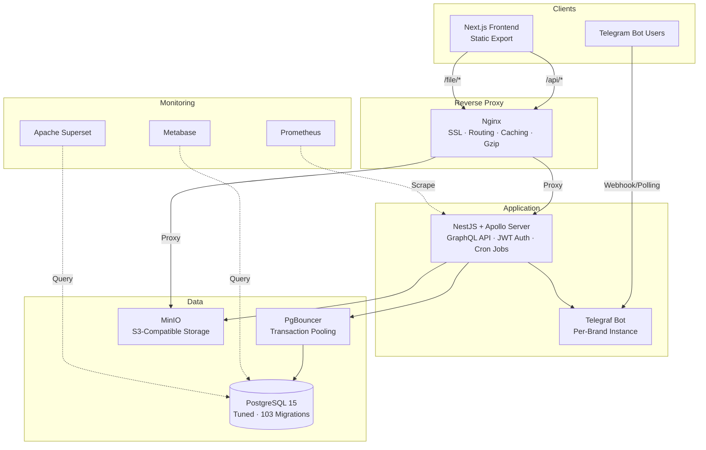

# OptiNetFlow — Backend

[](https://nestjs.com/)
[](https://graphql.org/)
[](https://www.typescriptlang.org/)
[](https://www.prisma.io/)
[](https://www.postgresql.org/)
[](https://www.docker.com/)

Production backend for a consumer subscription platform. **Solo-built and operated for 2+ years** — I was the sole developer, architect, and infrastructure operator.

> **See also:** [Frontend Repository](https://github.com/optinetflow/frontend) · [Architecture Decision Records](docs/adr/) · [Auth Flow](docs/auth-flow.md) · [Payment Flow](docs/payment-flow.md) · [Telegram Integration](docs/telegram-integration.md)

---

### At a Glance

| Metric | Value |
|:--|:--|
| **Total sales processed** | 100,000+ |
| **Peak concurrent subscribers** | 5,000+ |
| **Production uptime** | 2+ years (Dec 2023 – Feb 2026) |
| **Database migrations** | 103 (zero-downtime, continuous schema evolution) |
| **Backend commits** | 627 |
| **NestJS modules** | 15 (auth, payments, packages, telegram, promotions, …) |
| **Prisma models** | 15 models, 6 enums, 1 database view |
| **Infrastructure** | Fully self-managed — single ARM64 server, Docker Compose, no managed cloud |
| **Deployment** | Push-to-deploy via GitHub Actions → Docker Hub → SSH |

---

## Architecture



All services run in Docker containers on a shared network. No AWS/GCP managed services — database, storage, monitoring, and the application all run on a single ARM64 server via Docker Compose. [ADR-001: Why self-managed infrastructure](docs/adr/001-self-managed-infrastructure.md)

## Key Engineering Decisions

Each decision links to a detailed Architecture Decision Record in [`docs/adr/`](docs/adr/).

### Multi-Tenant Architecture via Brand Model &nbsp;→&nbsp; [ADR-002](docs/adr/002-multi-tenant-via-brand-model.md)

One codebase, one database, multiple white-label brands. Each brand has its own domain, Telegram bot, and reporting channels. Users are scoped via `@@unique([phone, brandId])`. Adding a new brand is a database insert, not a new deployment.

```prisma
model Brand {
  domainName  String @unique
  botToken    String
  botUsername String @unique
  User        User[]
}

model User {
  brandId String @db.Uuid
  brand   Brand? @relation(fields: [brandId], references: [id])
  @@unique([phone, brandId], name: "UserPhoneBrandIdUnique")
}
```

### Payment Approval via Telegram &nbsp;→&nbsp; [ADR-003](docs/adr/003-telegram-based-payment-approval.md)

No payment gateway was available due to regulatory constraints. Instead: user uploads receipt → image stored in MinIO → Telegram notification to admin with inline Accept/Reject buttons → payment state transitions → balance updated. Approval latency was typically under 60 seconds. [Full payment flow diagram →](docs/payment-flow.md)

```
User uploads receipt → MinIO → Telegram notification (inline keyboard)
                                        ↓
                        Admin taps Accept / Reject
                                        ↓
                        PENDING → APPLIED | REJECTED
                                        ↓
                        Balance credited, package provisioned
```

### Reseller Hierarchy with Cascading Profit Distribution

Two-tier user hierarchy: `parent` (direct reseller) and `referParent` (promotional referral). Parents set discount percentages for their children. On each purchase, profit cascades up the chain — each reseller earns the margin between their cost and the price they set downstream.

### Phone-Based OTP Authentication &nbsp;→&nbsp; [Auth Flow Docs](docs/auth-flow.md)

Register → SMS OTP → verify → JWT in HTTP-only cookie. Matches the target users (Iranian consumers who use phone numbers as primary identifiers). Configurable OTP expiration. Refresh tokens handled server-side.

### GraphQL Over REST &nbsp;→&nbsp; [ADR-004](docs/adr/004-graphql-over-rest.md)

The dashboard needs user info, packages, server stats, payments, and promotions in a single view. GraphQL lets the frontend fetch exactly what it needs per page. Full-stack type safety: Prisma schema → NestJS model → GraphQL schema → codegen → TypeScript hooks. A schema change surfaces compile errors in the frontend.

### PgBouncer Connection Pooling

5,000+ concurrent subscribers would exhaust PostgreSQL connections. PgBouncer in transaction mode maintains 50 pooled connections serving 200 concurrent clients. Prisma connects through PgBouncer with `?pgbouncer=true` to disable prepared statements (incompatible with transaction pooling).

### PostgreSQL Tuning for OLTP

Not running with defaults — tuned for this workload:

| Parameter | Value | Why |
|:--|:--|:--|
| `shared_buffers` | 2 GB | Dedicated buffer cache |
| `effective_cache_size` | 6 GB | Helps planner choose index scans |
| `work_mem` | 64 MB | Larger in-memory sorts |
| `jit` | off | JIT adds latency for short OLTP queries |
| `log_min_duration_statement` | 1000 ms | Logs slow queries for monitoring |
| `autovacuum_naptime` | 1 min | Frequent cleanup for high-write workload |

### Relay-Style Cursor Pagination

Uses `@devoxa/prisma-relay-cursor-connection` for cursor-based pagination. More reliable than offset pagination when data changes between page requests — important for continuously growing sales and payment data.

---

## Tech Stack

| Technology | Role | Why this over alternatives |
|:--|:--|:--|
| **NestJS 10** | Application framework | Modular DI architecture. For a solo dev managing 15+ modules, NestJS's opinionated structure prevents the codebase from becoming a monolithic Express app. Guards, interceptors, and pipes enforce cross-cutting concerns consistently. |
| **GraphQL (Apollo Server)** | API layer | Flexible data fetching across deeply nested relationships (users → packages → payments → stats). Eliminates dozens of REST endpoints. |
| **Prisma 7** | ORM + migrations | Type-safe DB access catching mismatches at compile time. 103 migrations tracked 2+ years of schema changes without data loss. |
| **PostgreSQL 15** | Database | Deep relational constraints (user hierarchies, payment → package → server chains) benefit from foreign keys and transactions. Custom-tuned for this workload. |
| **PgBouncer** | Connection pooling | Transaction-mode pooling. 50 connections serve 200 concurrent clients. |
| **MinIO** | Object storage | S3-compatible, self-hosted. Payment receipts and avatars. No cloud vendor lock-in. |
| **Telegraf** | Telegram bot | Per-brand bot instances. Registration, payment approval, notifications. Handles API errors (blocked bot, rate limits). |
| **Docker (ARM64)** | Containerization | Multi-stage builds. All services in Docker Compose. Healthchecks + autoheal for automatic recovery. |
| **GitHub Actions** | CI/CD | Build → SSH tunnel migrations → Docker push → SSH deploy. |
| **Prometheus** | Metrics | Application metrics scraping. |
| **Metabase + Superset** | Analytics | Business intelligence dashboards querying PostgreSQL directly. |

---

## Project Structure

```
src/
├── auth/              # JWT + OTP auth, signup/login, password reset
├── users/             # User CRUD, parent-child hierarchy, discounts
├── brand/             # Multi-tenant brand system (domain, bot, reports)
├── package/           # Subscription packages, purchases, renewals, bundles
├── payment/           # Payment processing, receipt verification, wallet recharge
├── telegram/          # Telegraf bot per brand — registration, approvals, notifications
├── server/            # Server management, country routing, inbound config
├── xui/               # X-UI panel API integration (client stats, provisioning)
├── promotion/         # Promo codes, referral system, gift packages
├── sms/               # SMS OTP delivery (SMS.ir)
├── minio/             # S3-compatible file storage (receipts, avatars)
├── prometheus/        # Prometheus metrics queries
├── ai/                # GCP Vertex AI integration
├── prisma/            # Database client, exception filters
├── common/
│   ├── configs/       # App configuration (JWT, CORS, Swagger, …)
│   ├── decorators/    # Custom decorators (current user, roles)
│   ├── guards/        # Auth guards (JWT, admin, optional)
│   ├── interceptors/  # Response timing
│   ├── pagination/    # Relay-style cursor pagination
│   ├── pipes/         # Validation pipes
│   └── services/      # Shared services (XUI client, server management)
├── app.module.ts      # Root module
├── main.ts            # Bootstrap — validation, filters, CORS, Swagger
└── gql-config.service.ts

prisma/
├── schema.prisma      # 15 models, 6 enums, 1 database view
├── migrations/        # 103 migrations (Dec 2023 → Feb 2026)
├── seed.ts
└── dbml/              # Auto-generated DBML diagram
```

## Database Schema

15 models tracking the full lifecycle from user signup through payment to service delivery:

| Model | Purpose |
|:--|:--|
| **User** | Core entity. Phone + brand scoped. Parent/child hierarchy for reseller network. Balance, profit tracking, discount config. |
| **Brand** | Multi-tenant isolation. Domain, Telegram bot, report groups. |
| **Package** | Subscription plans with traffic limits, expiration, pricing, category. |
| **UserPackage** | Purchased package instance. Links user → server → stats → payments. Bundle support. |
| **Payment** | States: `PENDING → APPLIED \| REJECTED`. Receipt images in MinIO. Profit distribution on approval. |
| **Server** | Server inventory. Country, domain, inbound config. Ingress/tunnel routing. |
| **ClientStat** | Per-client usage — traffic up/down/total, expiry, connection tracking. |
| **Promotion** | Reseller promo codes. Optional gift package, initial discount. |
| **UserGift** | Gift package redemption tracking. |
| **RechargePackage** | Wallet recharge options with discount percentages. |
| **TelegramUser** | Telegram ↔ user linkage. Avatar storage. |
| **BankCard** | User bank cards for payment verification. |
| **ActiveServer** | Category → active server mapping per country. |
| **PersianCalendar** | DB view — Jalali date conversions for reporting. |

## Deployment Pipeline

```
Push to main
     │
     ▼
GitHub Actions
     │
     ├── 1. Install deps + generate Prisma client
     │
     ├── 2. SSH tunnel to production DB
     │      └── prisma migrate deploy (zero-downtime)
     │
     ├── 3. Build ARM64 Docker image
     │      └── Push to Docker Hub (SHA + latest tags)
     │
     └── 4. SSH to production server
            ├── Pull image
            ├── Replace container
            └── Autoheal monitors /health endpoint
```

Migrations run against the live database via SSH tunnel *before* the new container deploys — the schema is always ready before new code starts.

## Documentation

| Document | Description |
|:--|:--|
| [ADR-001: Self-Managed Infrastructure](docs/adr/001-self-managed-infrastructure.md) | Why Docker Compose on a single server instead of managed cloud |
| [ADR-002: Multi-Tenant via Brand](docs/adr/002-multi-tenant-via-brand-model.md) | Row-level multi-tenancy with a Brand model |
| [ADR-003: Telegram Payment Approval](docs/adr/003-telegram-based-payment-approval.md) | Receipt → Telegram → inline button approval flow |
| [ADR-004: GraphQL Over REST](docs/adr/004-graphql-over-rest.md) | Full-stack type safety with code-first GraphQL |
| [ADR-005: Static Export Frontend](docs/adr/005-static-export-frontend.md) | Why no SSR — static export + client-side Apollo |
| [Auth Flow](docs/auth-flow.md) | Signup, login, OTP, JWT — sequence diagrams |
| [Payment Flow](docs/payment-flow.md) | Purchase and recharge flows — state machines |
| [Telegram Integration](docs/telegram-integration.md) | Bot architecture, callbacks, error handling |

## Local Development

```bash
git clone https://github.com/optinetflow/backend.git && cd backend
cp .env.example .env     # Edit with your values — every var is documented
pnpm install
pnpm docker:db           # Start PostgreSQL + PgBouncer
pnpm migrate:dev:deploy  # Apply migrations
pnpm prisma:generate     # Generate Prisma client
pnpm start:dev           # NestJS in watch mode
```

<details>
<summary><strong>All available scripts</strong></summary>

| Script | Purpose |
|:--|:--|
| `pnpm dev` | Start dev environment in Docker |
| `pnpm start:dev` | NestJS watch mode |
| `pnpm build` | Production build |
| `pnpm docker:db` | PostgreSQL + PgBouncer |
| `pnpm migrate:dev:create` | Create migration |
| `pnpm migrate:dev:deploy` | Apply migrations |
| `pnpm prisma:generate` | Regenerate Prisma client |
| `pnpm test` | Unit tests |
| `pnpm test:e2e` | E2E tests |
| `pnpm get-backup-db` | Pull production DB via SSH |
| `pnpm restore-backup-db` | Restore backup locally |

</details>

## License

MIT
