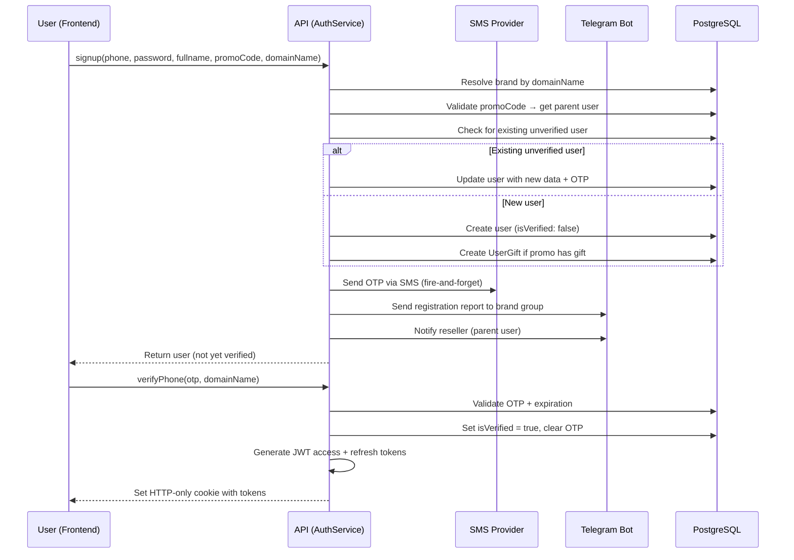
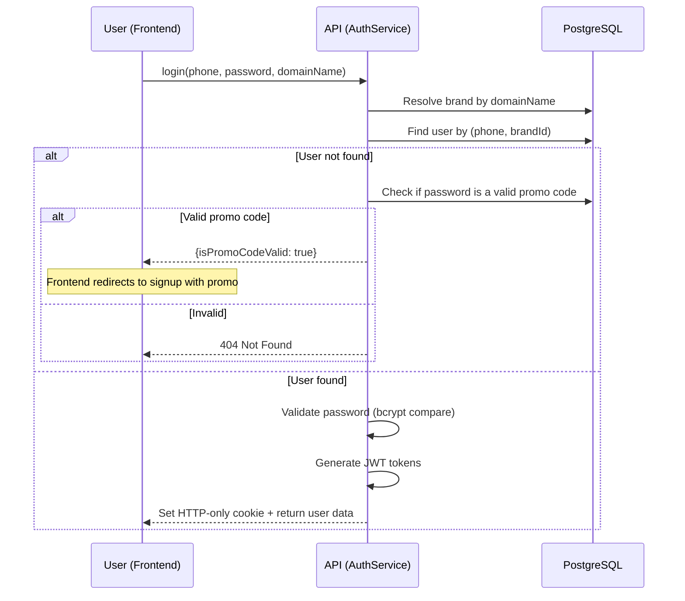

# Authentication Flow

## Overview

Phone-based authentication with OTP verification. JWT tokens stored in HTTP-only cookies. Three auth levels: unauthenticated, authenticated (user), and admin.

## Signup Flow

## Login Flow

## Token Management

- **Access token**: Signed with `JWT_ACCESS_SECRET`, expires per `ACCESS_TOKEN_EXPIRE_IN` (default: 7d).
- **Refresh token**: Signed with `JWT_REFRESH_SECRET`, longer-lived.
- **Storage**: Both tokens stored in a single HTTP-only cookie named `token` as JSON: `{accessT, refreshT}`.
- **Cookie settings**: `sameSite: strict`, `secure: true` in production, `httpOnly: true`, 2-year expiry.

## Auth Guards

| Guard | Behavior | Used for |
|---|---|---|
| `GqlAuthGuard` | Requires valid JWT. Returns 401 if missing/invalid. | All authenticated operations |
| `OptionalGqlAuthGuard` | Parses JWT if present, sets `req.user`. Allows unauthenticated access. | Signup (existing user creating sub-users) |
| `AdminGqlAuthGuard` | Requires valid JWT AND `user.role === 'ADMIN'`. | Admin-only operations |

## Password Validation

1. Compare against bcrypt hash of user's password.
2. If user has a `parentId`, also try the parent's password (allows resellers to access child accounts).

## OTP Details

- 4-digit numeric code: `Math.floor(1000 + Math.random() * 9000)`
- Configurable expiration via `OTP_EXPIRATION` env var (in minutes)
- Delivered via SMS.ir API
- Stored in `user.otp` and `user.otpExpiration` fields
- Cleared after successful verification
