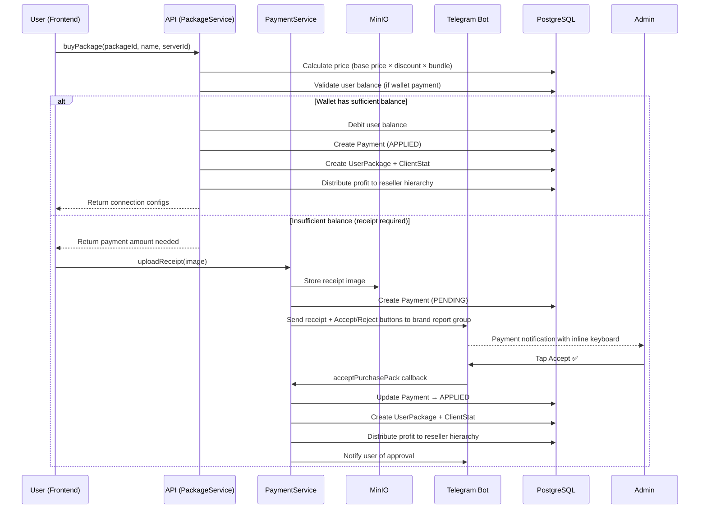
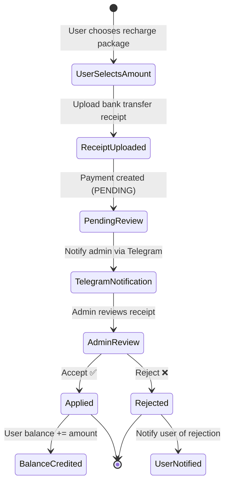

# Payment Flow

## Overview

Receipt-based payment system with Telegram-driven approval. Supports two primary flows: package purchases and wallet recharges. Payments flow through a state machine: `PENDING → APPLIED | REJECTED`.

## Payment Types

| Type | Description |
|---|---|
| `PACKAGE_PURCHASE` | User buys a subscription package |
| `WALLET_RECHARGE` | User adds funds to their wallet balance |
| `IRAN_SERVER_COST` | Internal: cost tracking for Iranian servers |
| `EXTERNAL_SERVER_COST` | Internal: cost tracking for external servers |

## Package Purchase Flow



## Pricing Model

Prices are calculated through a hierarchy of discounts:

1. **Base price**: Set on the Package model.
2. **User discount**: `appliedDiscountPercent` — set by the parent (reseller) for each child user.
3. **Bundle discount**: Long-term packages (3/6/12 months) get additional discounts.
4. **Recharge discount**: Wallet recharge packages have fixed discount percentages.

```
Final Price = Base Price × (1 - User Discount%) × Bundle Multiplier
```

## Profit Distribution

When a package is purchased, profit is distributed up the reseller hierarchy:

1. Calculate the **direct reseller's profit**: difference between what the end user paid and what the reseller's cost would be.
2. Credit `profitBalance` and `totalProfit` on the reseller's account.
3. This cascades up the parent chain — each level's profit is the margin between their cost and the price they set for their downstream.

## Wallet Recharge Flow



## Payment State Machine

```
PENDING ──Accept──▶ APPLIED
   │                    │
   │                    └─ Balance updated
   │                    └─ Package provisioned (if purchase)
   │                    └─ Profit distributed to hierarchy
   │
   └──Reject──▶ REJECTED
                    │
                    └─ User notified
                    └─ No balance change
```

## Receipt Storage

- Receipts are uploaded as images via `graphql-upload`.
- Temporarily stored with a UUID filename.
- Permanently stored in MinIO when the payment is created.
- Accessible via Nginx proxy at `/file/{bucket}/{filename}`.

## Telegram Approval Interface

Each payment notification includes:
- Payment amount and type
- User name and phone
- Receipt image (as photo attachment)
- Inline keyboard with Accept/Reject buttons
- Callback data encodes payment ID and action

The `AggregatorService` handles callbacks and ensures idempotent processing (checks payment state before applying changes).
