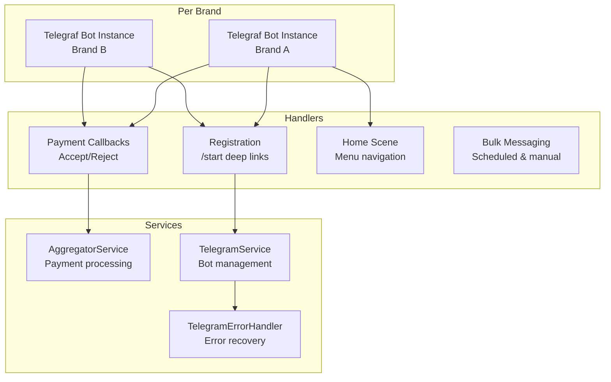

# Telegram Bot Integration

## Overview

Each brand operates its own Telegram bot. Bots handle user registration, payment approval/rejection, notifications, and bulk messaging. The integration uses [Telegraf](https://telegraf.js.org/) (Node.js Telegram Bot framework) via `nestjs-telegraf`.

## Architecture



## Bot Initialization

At application startup, `TelegramService` initializes one Telegraf bot per brand:

1. Query all active brands from the database.
2. For each brand, create a Telegraf instance with the brand's `botToken`.
3. Register command handlers, callback handlers, and scenes.
4. Launch each bot in polling mode.

Bots are stored in a `Map<brandId, Telegraf>` for lookup during operations.

## User Registration via Deep Links

Users register through Telegram deep links:

```
https://t.me/{botUsername}?start=uid={userId}
```

When a user clicks this link and starts the bot:
1. Extract `userId` from the deep link parameter.
2. Look up the user in the database.
3. Create or update `TelegramUser` with `chatId`, `firstname`, `lastname`, `username`.
4. Fetch and store the user's Telegram avatar in MinIO.
5. Send a welcome message with navigation buttons.

## Payment Approval Callbacks

Inline keyboard callbacks follow the pattern:

```
{action}_{paymentId}
```

Actions:
- `acceptPurchasePack` — approve a package purchase
- `rejectPurchasePack` — reject a package purchase
- `acceptRechargePack` — approve a wallet recharge
- `rejectRechargePack` — reject a wallet recharge
- `enableGift` — activate a gift package for a user

The `AggregatorService` processes each callback in a transaction to ensure atomicity.

## Error Handling

`TelegramErrorHandler.safeTelegramCall` wraps all Telegram API calls and handles common failure modes:

| Error | Handling |
|---|---|
| Bot blocked by user | Log and skip — don't retry |
| Chat not found | Log and skip |
| User deactivated | Log and skip |
| Bot kicked from group | Log and skip |
| Rate limit (429) | Log with retry-after delay |
| Network timeout | Log error |

This prevents Telegram API errors from crashing the application or blocking other operations.

## Scheduled Jobs

| Job | Interval | Description |
|---|---|---|
| `syncTelegramUsersInfo` | 24 hours | Refreshes Telegram user info (name, avatar) for all linked users |
| `negativeAdminBalanceNotification` | 5 minutes | Notifies admins with negative balances via Telegram |

## Notification Types

- **Signup reports**: New user registration with promo code details
- **Phone verification**: Confirmation of phone verification
- **Payment receipts**: Receipt image with Accept/Reject buttons
- **Payment status**: Approval or rejection notification to the user
- **Balance warnings**: Low/negative balance alerts to resellers
- **Threshold warnings**: Package usage threshold notifications
